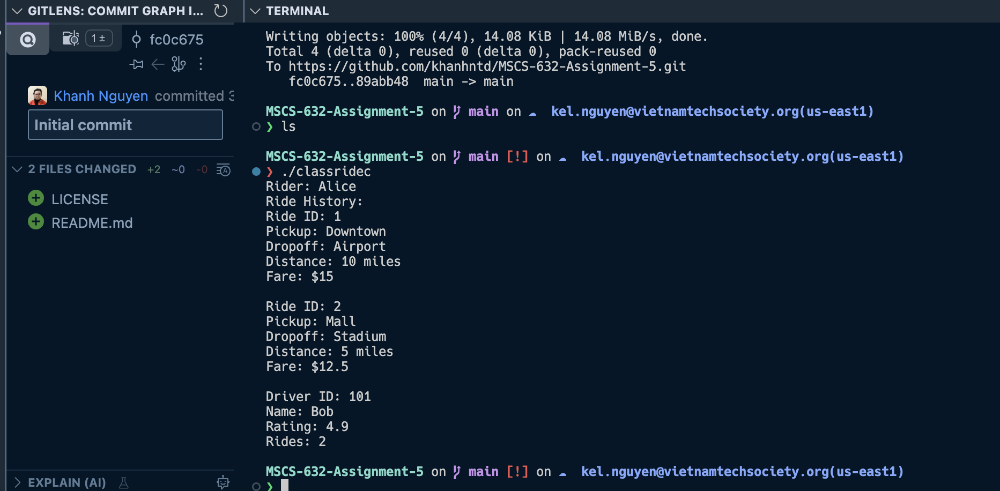

# MSCS-632-Assignment-5
## Setup
For C++
- **Step 1:** Download homebrew https://brew.sh/
- **Step 2:** Download gcc compiler https://formulae.brew.sh/formula/gcc

For SmallTalk
- **Step 1:** Download homebrew https://brew.sh/
- **Step 2:** Download gcc compiler https://formulae.brew.sh/formula/gcc

## Output
When running with the following command for rider simulation
```
g++ -o classridec classride.cpp
./classridec
```
the application will show all the requested rides alongside with the driver information and number of ride he/she has taken.


